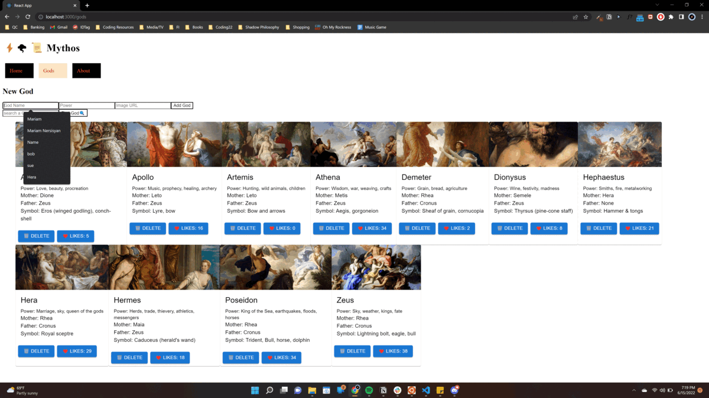
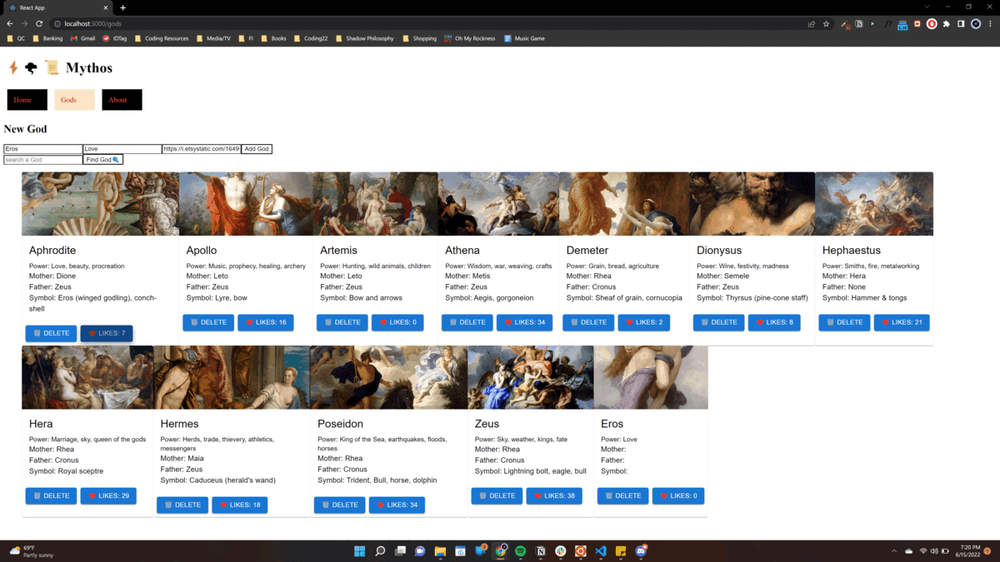
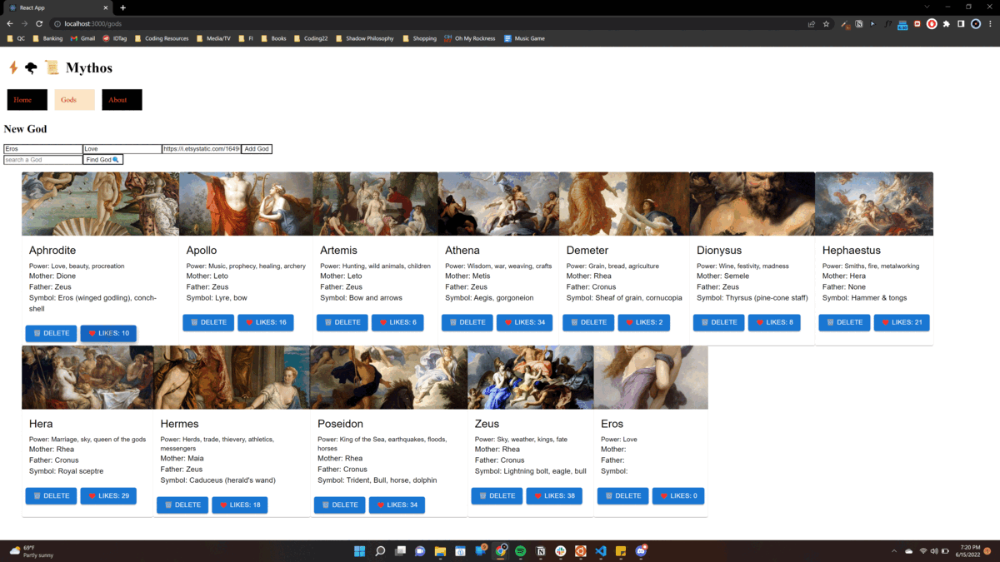

<!-- MYTHOS App
This app was made with mythology lovers in mind!

Features:
-Navigational routing
-A description of Mythos
-A page that lists Gods
-Form with the option to add a God of your liking
-Delete & Like Gods

How to Navigate:
Locate the Gods in the Navbar for a display of Gods

Fill out the New Gods Form with a God of your choice & press the button

Like a God by pressing the Like button & watch the like counter increment

Delete a God by pressing the Delete button. Navigate to the About page to see some mytho info!
 -->

Additional Data:
{
"name": "Charites",
"romanname": "Gratiae",
"power": "Grace, joy, mirth, beauty, glory, dance",
"symbol": "None",
"father": "Zeus",
"mother": "Eurynome",
"url": "https://hannahfielding.net/wp-content/uploads/2019/03/Botticelli-primavera-three-e1552561355704.jpg",

    },
    {
      "name": "Eileithyia",
      "romanname": "Lucina",
      "power": "Childbirth",
      "symbol": "Torch",
      "father": "Zeus",
      "mother": "Hera",
      "url": "https://www.timelessmyths.com/wp-content/uploads/2020/01/eos.jpg"
    },
    {
      "name": "Eros",
      "romanname": "Cupid, Amor",
      "power": "Love, sexual desire",
      "symbol": "Bow",
      "father": "arrow",
      "mother": "Aphrodite",
      "url": "https://i.etsystatic.com/16496201/r/il/510c7f/3755512194/il_1588xN.3755512194_k4t9.jpg"
    },
    {
      "name": "Hebe",
      "romanname": "Juventas",
      "power": "Youth, brides",
      "symbol": "Cup, pitcher",
      "father": "Zeus",
      "mother": "Hera",
      "url": "https://upload.wikimedia.org/wikipedia/commons/thumb/e/e2/Jacques_Louis_Dubois_-_Hebe.jpg/586px-Jacques_Louis_Dubois_-_Hebe.jpg"
    },
    {
      "name": "Hestia",
      "romanname": "Vesta",
      "power": "Hearth, home",
      "symbol": "Kettle",
      "father": "Cronus",
      "mother": "Rhea",
      "url": "https://greektraveltellers.com/images/Blog/Greek%20Gods/Greek-Goddess-Hestia.jpg"
    },
    {
      "name": "Horae",
      "romanname": "Dike, Eunomia, Irene",
      "power": "The seasons, natural order",
      "symbol": "Fruit",
      "father": "Zeus",
      "mother": "Themis",
      "url": "https://upload.wikimedia.org/wikipedia/commons/f/fe/Horae_Serenae_-_Edward_John_Poynter.jpg"
    },
    {
      "name": "Hygeia",
      "romanname": "Salus",
      "power": "Good health",
      "symbol": "Snake",
      "father": "Asclepius",
      "mother": "Epione",
      "url": "https://www.dia.org/sites/default/files/tms-collections-objects/44.266-S1.jpeg"
    },
    {
      "name": "Iris",
      "romanname": "Iris, Arcus",
      "power": "The rainbow, messenger of the gods",
      "symbol": "Herald's wand",
      "father": "Thaumas",
      "mother": "Electra",
      "url": "https://eclecticlightdotcom.files.wordpress.com/2021/02/vigeelebruniris.jpg"
    },
    {
      "name": "Leto",
      "romanname": "Latona",
      "power": "Motherhood, demureness",
      "symbol": "Veil",
      "father": "Coeus",
      "mother": "Phoebe",
      "url": "https://eclecticlightdotcom.files.wordpress.com/2017/06/carraccilatonalycia.jpg"
    },
    {
      "name": "Moirae",
      "romanname": "Parcae, Fatae",
      "power": "Fate, destiny",
      "symbol": "Spindle,thread, shears",
      "father": "Zeus",
      "mother": "Themis",
      "url": "https://upload.wikimedia.org/wikipedia/commons/thumb/d/db/Schadow_Grabmal_Alexander_2.jpg/1024px-Schadow_Grabmal_Alexander_2.jpg"
    },
    {
      "name": "Muses",
      "romanname": "Musae",
      "power": "Music, poetry, the arts",
      "symbol": "Lyre, cithara, flute",
      "father": "Zeus",
      "mother": "Mnemosyne",
      "url": "https://www.mythindex.com/wp-content/uploads/2020/07/painting-muses.jpg"
    },
    {
      "name": "Nike",
      "romanname": "Victoria",
      "power": "Victory",
      "symbol": "Palm branch, wings",
      "father": "Pallas",
      "mother": "Styx",
      "url": "https://i.pinimg.com/originals/e8/3c/a6/e83ca6e70fa0b6a3eb00b5102232d04c.jpg"
    },
    {
      "name": "Themis",
      "romanname": "Themis",
      "power": "Divine law, custom, assemblies, oracles",
      "symbol": "Tripod",
      "father": "Uranus",
      "mother": "Gaea",
      "url": "https://www.greeklegendsandmyths.com/uploads/5/3/1/3/53133595/display-image-php_11.jpg?614"
    },
    {
      "name": "Tyche",
      "romanname": "Fortuna",
      "power": "Fortune, luck",
      "symbol": "Cornucopia, rudder",
      "father": "Oceanus",
      "mother": "Tethys",
      "url": "http://2.bp.blogspot.com/-yfwPuy_57Lw/VT9GzPO5QiI/AAAAAAAACjo/aHNnbOjed-A/w1200-h630-p-k-no-nu/Tyche%2B01greekmythology.jpg"
    },
    {
      "name": "Atlas",
      "romanname": "Atlas",
      "power": "Bearer of the heavens, astronomy",
      "symbol": "Celestial sphere",
      "father": "Iapetus",
      "mother": "Clymene",
      "url": "https://images.saymedia-content.com/.image/ar_1:1%2Cc_fill%2Ccs_srgb%2Cfl_progressive%2Cq_auto:eco%2Cw_1200/MTc0MzAxMTg4NjI2MzkyOTU2/the-titan-atlas.jpg"
    },
    {
      "name": "Cronus",
      "romanname": "Saturnus, Saturn",
      "power": "Time, king of the Titans",
      "symbol": "Sickle",
      "father": "Uranus",
      "mother": "Gaea",
      "url": "https://www.thoughtco.com/thmb/U5E1YnK3s4j5F695WuSpWiN5-C4=/1333x1000/smart/filters:no_upscale()/Chronus-5a53d42447c26600369af31e.jpg"
    },
    {
      "name": "Mnemosyne",
      "romanname": "Moneta",
      "power": "Memory",
      "symbol": "Mount Pieria",
      "father": "Uranus",
      "mother": "Gaea",
      "url": "https://images.fineartamerica.com/images/artworkimages/mediumlarge/1/jupiter-disguised-as-a-shepherd-seducing-mnemosyne-the-goddess-of-memory-jacob-de-wit.jpg"
    },
    {
      "name": "Oceanus",
      "romanname": "Oceanus",
      "power": "River Oceanus, fresh water",
      "symbol": "Serpent, fish",
      "father": "Uranus",
      "mother": "Gaea",
      "url": "https://www.mfab.hu/app/uploads/2018/11/26512.jpg"
    },
    {
      "name": "Prometheus",
      "romanname": "Prometheus",
      "power": "Forethought, crafty counsel",
      "symbol": "None",
      "father": "Iapetus",
      "mother": "Clymene",
      "url": "https://upload.wikimedia.org/wikipedia/commons/thumb/9/9a/Rubens_-_Prometheus_Bound.jpg/1200px-Rubens_-_Prometheus_Bound.jpg"
    },
    {
      "name": "Rhea",
      "romanname": "Ops, Opis",
      "power": "Mother of the gods, mountains",
      "symbol": "Turret crown, cymbal",
      "father": "Uranus",
      "mother": "Gaea",
      "url": "https://upload.wikimedia.org/wikipedia/commons/1/1d/Rubens_-_Mars_et_Rhea_Silvia.jpg"
    },
    {
      "name": "Tethys",
      "romanname": "Tethys",
      "power": "Fresh water, nursing",
      "symbol": "Winged brow",
      "father": "Uranus",
      "mother": "Gaea",
      "url": "https://media.istockphoto.com/photos/god-oceanos-and-his-wife-tethys-picture-id155323384"
    },
    {
      "name": "Asteria",
      "romanname": "Asteria",
      "power": "Shooting stars, nighttime divination",
      "symbol": "None",
      "father": "Coeus",
      "mother": "Phoebe",
      "url": "http://1.bp.blogspot.com/-ufCAYRkvQ1c/Ul1En5gR5tI/AAAAAAAAAS8/z_2jbrqrBgY/s1600/waterhouse_the_charmer_BMJ.jpg"
    },
    {
      "name": "Eos",
      "romanname": "Aurora",
      "power": "The dawn",
      "symbol": "None",
      "father": "Hyperion",
      "mother": "Thea",
      "url": "https://upload.wikimedia.org/wikipedia/commons/6/64/Eos.jpg"
    },
    {
      "name": "Hecate",
      "romanname": "Trivia",
      "power": "Witchcraft, magic, ghosts",
      "symbol": "Two torches",
      "father": "Perses",
      "mother": "Asteria",
      "url": "https://eclecticlightdotcom.files.wordpress.com/2020/07/pirnerhekate.jpg"
    },
    {
      "name": "Helius",
      "romanname": "Sol",
      "power": "The sun, sight",
      "symbol": "Aureole",
      "father": "Hyperion",
      "mother": "Thea",
      "url": "https://classicalwisdom.com/wp-content/uploads/2018/10/Helios.jpg"
    },
    {
      "name": "Selene",
      "romanname": "Luna",
      "power": "The moon",
      "symbol": "Lunar disc or crescent, bull's horns",
      "father": "Hyperion",
      "mother": "Thea",
      "url": "https://www.dia.org/sites/default/files/tms-collections-objects/36.11-S1.jpeg"
    },
    {
      "name": "Ananke",
      "romanname": "Necessitas",
      "power": "Necessity, compulsion",
      "symbol": "Torch",
      "father": "Hydros",
      "mother": "Gaea",
      "url": "https://64.media.tumblr.com/f286df054f6516b152e5b13d5b86a8c4/tumblr_nox4xg8G9U1sp4xseo1_r1_1280.jpg"
    },
    {
      "name": "Chronos Aeon",
      "romanname": "Chronos Aeon",
      "power": "Time, eternity",
      "symbol": "Zodiac-wheel",
      "father": "Hydros",
      "mother": "Gaea",
      "url": "https://eclecticlightdotcom.files.wordpress.com/2016/04/poussindancemusictime.jpg"
    },
    {
      "name": "Gaea",
      "romanname": "Terra, Tellus",
      "power": "The earth",
      "symbol": "Fruit and grain",
      "father": "None",
      "mother": "None",
      "url": "https://i.pinimg.com/originals/5d/de/40/5dde402619db370f71c1f0da2cedeece.jpg"
    },
    {
      "name": "Hemera",
      "romanname": "Dies",
      "power": "The day",
      "symbol": "None",
      "father": "Erebus",
      "mother": "Nyx",
      "url": "https://upload.wikimedia.org/wikipedia/commons/thumb/d/d3/William-Adolphe_Bouguereau_%281825-1905%29_-_Day_%281881%29.jpg/220px-William-Adolphe_Bouguereau_%281825-1905%29_-_Day_%281881%29.jpg"
    },
    {
      "name": "Nyx",
      "romanname": "Nox",
      "power": "The night",
      "symbol": "None",
      "father": "None",
      "mother": "Chaos",
      "url": "https://eclecticlightdotcom.files.wordpress.com/2018/06/geromenight.jpeg"
    },
    {
      "name": "Ourea",
      "romanname": "Montes",
      "power": "The mountains",
      "symbol": "None",
      "father": "None",
      "mother": "Gaea",
      "url": "http://www.greekmythology.com/images/mythology/ourea_189.jpg"
    },
    {
      "name": "Uranus",
      "romanname": "Caelum",
      "power": "The sky, the starry heavens",
      "symbol": "Zodiac wheel",
      "father": "None",
      "mother": "Gaea",
      "url": "https://eclecticlightdotcom.files.wordpress.com/2020/06/schinkeluranusdanceofstars.jpg"
    },
    {
      "name": "Cerberus",
      "romanname": "Cerberus",
      "power": "Death, darkness",
      "symbol": "Three-headed dog, mane of serpents",
      "father": "Typhoeus",
      "mother": "Echidna",
      "url": "https://uploads4.wikiart.org/00380/images/francisco-de-zurbaran/hercules-and-cerberus-francisco-de-zurbaran.jpg!Large.jpg"
    },
    {
      "name": "Charon",
      "romanname": "Charon",
      "power": "Ferryman of the Dead",
      "symbol": "Skiff",
      "father": "Erebus",
      "mother": "Nyx",
      "url": "https://images.fineartamerica.com/images/artworkimages/mediumlarge/1/1-charon-boat-jose-benlliure.jpg"
    },
    {
      "name": "Erinyes",
      "romanname": "Furiae, Dirae",
      "power": "Vengeance, retribution",
      "symbol": "Vipers",
      "father": "Gaea",
      "mother": "the blood of Uranus",
      "url": "https://eclecticlightdotcom.files.wordpress.com/2017/01/rahlorestesfuries.jpg"
    },
    {
      "name": "Hades",
      "romanname": "Pluto, Dis, Orcus",
      "power": "The dead, king of the underworld",
      "symbol": "Royal sceptre, cornucopia",
      "father": "Cronus",
      "mother": "Rhea",
      "url": "https://i.pinimg.com/originals/f8/bc/fb/f8bcfb65acc1a5c97f270945c19d1c5b.jpg"
    },
    {
      "name": "Hypnos",
      "romanname": "Somnus, Sopor",
      "power": "Sleep",
      "symbol": "None",
      "father": "None",
      "mother": "Nyx",
      "url": "https://render.fineartamerica.com/images/images-profile-flow/400/images/artworkimages/mediumlarge/1/morpheus-or-sleep-jean-bernard-restout.jpg"
    },
    {
      "name": "Persephone",
      "romanname": "Proserpina",
      "power": "Spring, queen of the underworld",
      "symbol": "Torch",
      "father": "Zeus",
      "mother": "Demeter",
      "url": "https://media.tate.org.uk/art/images/work/N/N05/N05064_10.jpg"
    },
    {
      "name": "Thanatos",
      "romanname": "Mors, Letum",
      "power": "Death",
      "symbol": "Sword",
      "father": "None",
      "mother": "Nyx",
      "url": "https://eclecticlightdotcom.files.wordpress.com/2020/04/fuselithanatos.jpg"
    },
    {
      "name": "Amphitrite",
      "romanname": "Salacia",
      "power": "The sea, fish, shellfish",
      "symbol": "Fish, dolphin",
      "father": "Nereus",
      "mother": "Thetis",
      "url": "https://images.fineartamerica.com/images/artworkimages/mediumlarge/1/the-triumph-of-amphitrite-hugues-taraval.jpg"
    },
    {
      "name": "Galatea",
      "romanname": "Galatea",
      "power": "Calm seas",
      "symbol": "None",
      "father": "Nereus",
      "mother": "Doris",
      "url": "https://www.historytoday.com/sites/default/files/Galatea.jpg"
    },
    {
      "name": "Nereus",
      "romanname": "Nereus",
      "power": "Fish",
      "symbol": "Fish",
      "father": "Pontus",
      "mother": "Gaea",
      "url": "https://www.prints-online.com/p/164/50-daughters-nereus-mounted-sea-monster-23151826.jpg"
    },
    {
      "name": "Scylla",
      "romanname": "Scylla",
      "power": "Tear, Rend",
      "symbol": "Nome",
      "father": "None",
      "mother": "Crataeis",
      "url": "https://www.greekmythologyinart.com/uploads/5/3/1/3/53133595/rubens-scylla.jpg"
    },
    {
      "name": "Sirens",
      "romanname": "Sirens",
      "power": "Bodies of birds, heads of women",
      "symbol": "None",
      "father": "Achelous",
      "mother": "Melpomene",
      "url": "https://images.fineartamerica.com/images/artworkimages/mediumlarge/1/the-sirens-wilhelm-kray.jpg"
    },
    {
      "name": "Thetis",
      "romanname": "Thetis",
      "power": "The sea, leader of the Nereides",
      "symbol": "None",
      "father": "Nereus",
      "mother": "Doris",
      "url": "https://upload.wikimedia.org/wikipedia/commons/8/89/Thetis_and_Zeus_by_A.Losenko.jpg"
    },
    {
      "name": "Triton",
      "romanname": "Triton",
      "power": "Waves, calm seas, herald of Poseidon",
      "symbol": "Conch shell",
      "father": "Poseidon",
      "mother": "Amphitrite",
      "url": "https://images.fineartamerica.com/images/artworkimages/mediumlarge/1/venus-and-triton-attributed-to-francesco-podesti.jpg"
    },
    {
      "name": "Anemoi",
      "romanname": "Venti",
      "power": "The winds",
      "symbol": "None",
      "father": "Astraeus",
      "mother": "Eos",
      "url": "https://espressocomsaudade.files.wordpress.com/2015/07/boreas.jpg"
    },
    {
      "name": "Boreas",
      "romanname": "Aquilo",
      "power": "The north wind, winter",
      "symbol": "None",
      "father": "Astraeus",
      "mother": "Eos",
      "url": "https://upload.wikimedia.org/wikipedia/commons/f/f5/Boreas.jpg"
    },
    {
      "name": "Hesperides",
      "romanname": "Hesperides",
      "power": "Evening, sunsets",
      "symbol": "Golden apple",
      "father": "Atlas",
      "mother": "Nyx",
      "url": "https://images.fineartamerica.com/images/artworkimages/mediumlarge/1/hercules-in-the-garden-of-the-hesperides-michele-rocca.jpg"
    },
    {
      "name": "Zephyrus",
      "romanname": "Zephyrus, Favonius",
      "power": "The west wind, spring",
      "symbol": "None",
      "father": "Astraeus",
      "mother": "Eos",
      "url": "https://www.arthipo.com/image/cache/catalog/artists-painters/s/sandro-botticelli/sandro-botecelli-the-birth-of-venus-zephyr-and-chloris-merkur-flora-venusun-dogumu-1000x1000.jpg"
    },
    {
      "name": "Ariadne",
      "romanname": "Libera",
      "power": "Crown",
      "symbol": "Most Holy",
      "father": "Minos",
      "mother": "Pasiphae",
      "url": "https://www.greeklegendsandmyths.com/uploads/5/3/1/3/53133595/ariadne_1_orig.jpg"
    },
    {
      "name": "Nymphs",
      "romanname": "Nymphs",
      "power": "Nature",
      "symbol": "None",
      "father": "Zeus",
      "mother": "Gaea",
      "url": "https://upload.wikimedia.org/wikipedia/commons/b/bd/Waterhouse_Hylas_and_the_Nymphs_Manchester_Art_Gallery_1896.15.jpg"
    },
    {
      "name": "Pan",
      "romanname": "Faunus",
      "power": "Shepherds, hunters, mountain forests and meadows",
      "symbol": "Panpipes",
      "father": "Hermes",
      "mother": "Penelope",
      "url": "https://images.fineartamerica.com/images/artworkimages/mediumlarge/1/1-pan-playing-his-pipes-paulus-moreelse.jpg"
    },
    {
      "name": "Potamoi",
      "romanname": "Flumina, Amnes",
      "power": "The rivers",
      "symbol": "Water-pitcher, cornucopia",
      "father": "Oceanus",
      "mother": "Tethys",
      "url": "https://images.saymedia-content.com/.image/t_share/MTc2MjY2ODg2NDQxNjczOTAx/potamoi-river-gods-of-greek-mythology.jpg"
    },
    {
      "name": "Priapus",
      "romanname": "Mutunus",
      "power": "Vegetable gardens",
      "symbol": "Basket of vegetables",
      "father": "Dionysus",
      "mother": "Aphrodite",
      "url": "https://render.fineartamerica.com/images/rendered/default/print/6/8/break/images-medium/invocation-to-priapus-granger.jpg"
    },
    {
      "name": "Satyrs",
      "romanname": "Fauns",
      "power": "Fertility",
      "symbol": "Wineskin, drinking-horn, double-flute",
      "father": "Silenus",
      "mother": "Various",
      "url": "https://images.fineartamerica.com/images/artworkimages/mediumlarge/2/a-satyr-jacob-jordaens-i.jpg"
    },
    {
      "name": "Silenus",
      "romanname": "Silenus",
      "power": "Drunkenness, wine-making",
      "symbol": "None",
      "father": "None",
      "mother": "Gaea",
      "url": "https://www.artnews.com/wp-content/uploads/2020/07/Drunken-Silenus-2.jpg"
    },
    {
      "name": "Dike",
      "romanname": "Justicia",
      "power": "Justice",
      "symbol": "None",
      "father": "Zeus",
      "mother": "Themis",
      "url": "http://www.maicar.com/GML/000Images/dim/dike0616.jpg"
    },
    {
      "name": "Eris",
      "romanname": "Discordia",
      "power": "Strife, discord",
      "symbol": "None",
      "father": "None",
      "mother": "Nyx",
      "url": "https://eclecticlightdotcom.files.wordpress.com/2017/11/jordaensgoldenapplediscord.jpg"
    },
    {
      "name": "Geras",
      "romanname": "Senectus",
      "power": "Old age",
      "symbol": "None",
      "father": "None",
      "mother": "Nyx",
      "url": "https://wahooart.com/Art.nsf/O/A2AAT5/$File/Paul_Troger-Geras_marmorsaal_fresco_loaves.JPG"
    },
    {
      "name": "Nemesis",
      "romanname": "Nemesis, Rivalitas",
      "power": "Retribution, indignation",
      "symbol": "Sword, lash",
      "father": "None",
      "mother": "Nyx",
      "url": "https://eclecticlightdotcom.files.wordpress.com/2020/05/tattarescunemesis.jpg"
    },
    {
      "name": "Peitho",
      "romanname": "Suada, Suadela",
      "power": "Persuasion, seduction",
      "symbol": "Ball of twine",
      "father": "Oceanus",
      "mother": "Tethys",
      "url": "https://upload.wikimedia.org/wikipedia/commons/2/25/Eros_brought_by_Peitho_to_Aphrodite_as_Anteros_laughs_at_his_being_punished_for_having_chosen_the_wrong_target%2C_Pompeiian_fresco%2C_circa_25_BCE_%2828298194699%29.jpg"
    },
    {
      "name": "Deimos & Phobos",
      "romanname": "Metus, Pavor, Terror",
      "power": "Fear, panic, terror",
      "symbol": "None",
      "father": "Ares",
      "mother": "Aphrodite",
      "url": "https://upload.wikimedia.org/wikipedia/commons/c/cd/Gigantomachy_Staatliche_Antikensammlungen_1553.jpg"
    },

    {
      "name": "Pothos",
      "romanname": "Pothos",
      "power": "Sexual longing, yearning",
      "symbol": "None",
      "father": "None",
      "mother": "Aphrodite",
      "url": "https://upload.wikimedia.org/wikipedia/commons/thumb/4/48/Pothos%2C_lira%2C_dan_angsa_%28inv_6253_MANN%29.jpg/220px-Pothos%2C_lira%2C_dan_angsa_%28inv_6253_MANN%29.jpg"
    },
    {
      "name": "Soteria",
      "romanname": "Salus",
      "power": "Safety and Deliverance",
      "symbol": "None",
      "father": "Zeus",
      "mother": "Dionysus",
      "url": "https://greekreporter.com/wp-content/uploads/2014/08/Circe_Offering_the_Cup_to_Odysseus-john-william-waterhouse-credit-public-domain.jpg"
    },
    {
      "name": "Dioscuri",
      "romanname": "Castor, Pollux",
      "power": "Horsemanship, St. Elmo's fire",
      "symbol": "None",
      "father": "Zeus, Tyndareus",
      "mother": "Leda",
      "url": "https://preview.redd.it/tvk6r4zl1t641.jpg?auto=webp&s=0839d5d61435ee906523bce38c01cc8b28c12239"
    },
    {
      "name": "Psyche",
      "romanname": "Psyche",
      "power": "The soul",
      "symbol": "Butterfly",
      "father": "None",
      "mother": "None",
      "url": "https://womennart.files.wordpress.com/2019/02/psyche-entering-cupid-s-garden-1903.jpglarge.jpg"
    }

]

}
